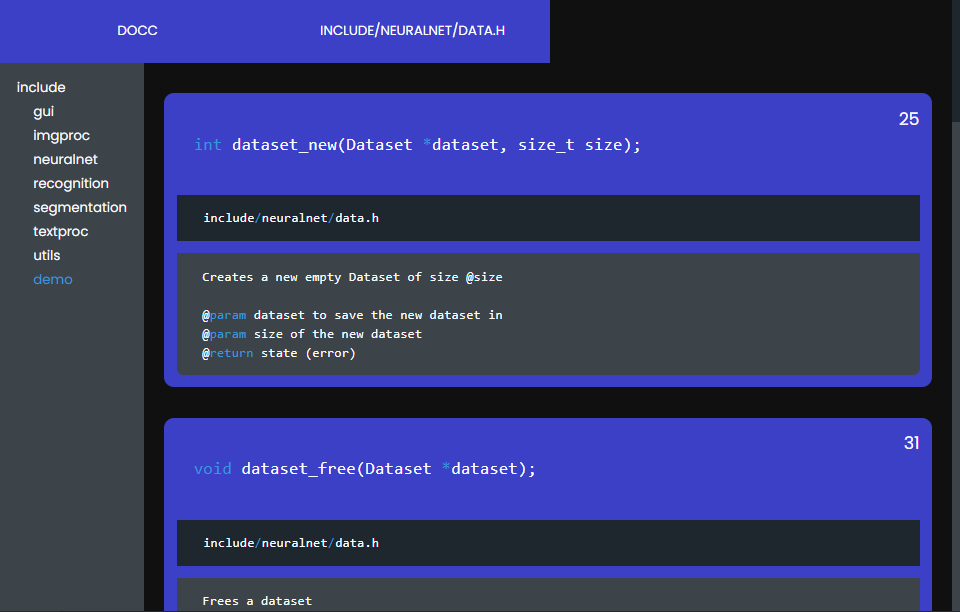

# Docc
Docc is a CLI tool to create **doc**umentation on **c** projects.

## Pictures

<p align="center">
  
  <br>
  <a href="https://github.com/prismocr/ocr">Repository</a>
</p>


## Get started
* go install github.com/Flowtter/docc
* cd to a c project
* docc `l`

## Arguments
* `l` : open in browser
* `help` : display help

## Docker

```bash
$ docker run -it --rm -v $PWD/my_include_path:/include -v $PWD/output:/html-docc flowtter/docc 
```
> Open `output/index.html`.